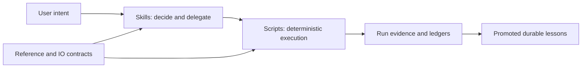

# xLLM AI Coding Workflow

Languages: [English](README.md) | [简体中文](README_zh.md)

Evidence-driven workflows, skills, scripts, and reference knowledge for large-model serving on Ascend NPUs. **xLLM is the complete primary path.** vLLM-Ascend and SGLang are limited to the experimental adapter or artifact-analysis scopes declared in the [skill map](docs/architecture/skill-map.md).

## Choose your path

| Goal | Start with |
|---|---|
| Create, resume, finalize, or archive an experiment | `xllm-experiment-lifecycle` |
| Optimize xLLM performance through multiple iterations | `xllm-npu-sota-loop` |
| Run a mixed performance and accuracy suite | `xllm-npu-eval-runner` |
| Run one performance or accuracy workload | `xllm-npu-perf-runner` or `xllm-npu-accuracy-runner` |
| Launch, verify, smoke-test, and clean up a service | `xllm-npu-server-manager` |
| Review fairness or a publishable performance claim | `xllm-npu-benchmark` |
| Collect or analyze profiling evidence | `xllm-npu-profiler` or `xllm-npu-pipeline-analysis` |
| Diagnose wrong output or a runtime/build incident | `xllm-npu-accuracy-debug` or `xllm-npu-incident-triage` |
| Query historical model and PR lessons | `model-pr-optimization-history` |

For an optimization campaign, `xllm-npu-sota-loop` owns the optimization decisions while `xllm-experiment-lifecycle` owns the resumable run and evidence state.

## Five-minute start

Initialize or reuse the xLLM checkout and install the canonical skills:

```bash
python scripts/init_xllm_workspace.py
```

Start Codex from this repository:

```bash
codex
```

Then choose a [copy-ready prompt](prompts/) or create an experiment from [`experiment.example.yaml`](reference/io_specs/experiment.example.yaml). Follow the [getting-started guide](docs/getting-started.md) for a synthetic lifecycle walkthrough.

## How the pieces fit together



Lifecycle is the control plane. Orchestrators delegate bounded work to runners, analyzers, planners, and gates. Deterministic scripts produce auditable artifacts.

## Browse capabilities

- [Skill capability index](skills/README.md) — grouped by role and domain.
- [Detailed skill architecture](docs/architecture/skill-map.md) — dependencies, scopes, intents, and outputs.
- [Agent routing contract](AGENTS.md) — exact task-to-skill and repository constraints.

## Documentation

Use the [documentation hub](docs/README.md) to find current user, architecture, workflow, and maintainer guides. The [standard NPU AI coding workflow](docs/npu-ai-coding-standard-workflow.md) explains the evidence-driven phases. Historical PR design records are preserved separately and are not the normal operating entry point.

## Repository map

```text
skills/       procedural decisions and delegation
scripts/      deterministic execution
reference/    stable knowledge and IO contracts
runs/         per-task evidence; local and gitignored
humanize/     promoted validated lessons
docs/         current guides, architecture, and design history
tests/        catalog, navigation, schema, and workflow validation
```

See the [repository and evidence map](docs/architecture/repository-map.md) for ownership boundaries.

## Contribution and support boundaries

Reusable decision workflows belong in skills; deterministic operations belong in scripts; schemas and stable knowledge belong in reference; only validated durable lessons are promoted to humanize. Read [Adding or changing a skill](docs/maintainers/adding-or-changing-a-skill.md) before changing cataloged capabilities.

Do not commit local paths, private hosts, credentials, or non-public logs. The repository does not currently include a license; add one before broad external reuse.
