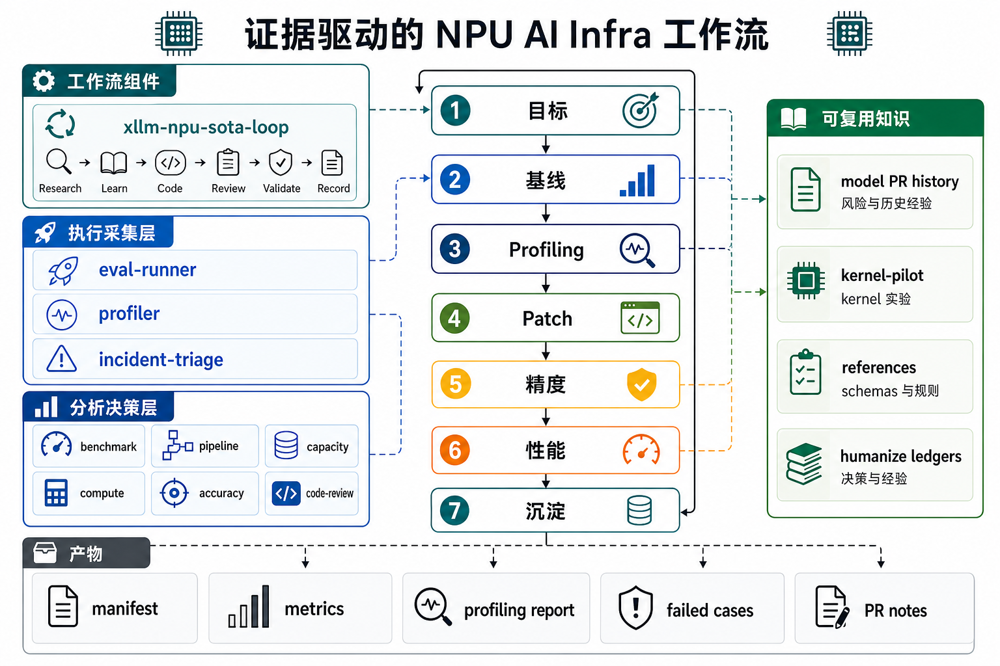

# xLLM AI Coding Workflow

语言：[English](README.md) | [简体中文](README_zh.md)

面向昇腾 NPU 大模型推理优化的 agent-ready 工作流、Prompt、证据规范和参考知识库。
首个落地目标：[xLLM](https://github.com/jd-opensource/xllm)；公平基线：
[vLLM-Ascend](https://github.com/vllm-project/vllm-ascend) 和 SGLang NPU。

**本仓库可以处理的任务：**

1. **特性设计与开发** — 设计新的 NPU serving 特性，编写代码，通过 review-gated 证据闭环验证。
2. **问题定位与修复** — 定位精度回归、crash、OOM、图模式失败或 HCCL 问题，产出可复现证据和验证过的 patch。
3. **性能优化** — 建立公平基线，采集 profiling 证据，识别瓶颈，迭代逼近 TPOT/TTFT/TPS 目标并量化收益。

## 1 快速开始

### A. 初始化 xLLM 代码和 Skills

方式 1：在本项目根目录启动 code agent。脚本会克隆或复用 `code/xllm`，把本项目
`skills/*` 软链接到 `.agents/skills`，并把 xLLM 仓内 skills 也链接到同一个生成目录。

```bash
python scripts/init_xllm_workspace.py
```

方式 2：在 `code/xllm` 下启动 code agent。同一个脚本会把本项目 `skills/*`
安装到所选 agent 的 skills 目录，xLLM 则继续使用它仓库内自己的 skills。

```bash
python scripts/init_xllm_workspace.py --mode xllm --agent codex
```

初始化脚本会在需要时从 `config.example.json` 生成本地 `config.json`，再读取 xLLM
仓库配置；如果配置缺失，会询问 Git URL 和分支或 commit，并写回本地
`config.json`。当 `code/xllm` 不存在或为空时，脚本会拉取代码；如果目录已存在，
则复用现有代码。

### B. 启动 Code Agent

方式 1：在当前仓库根目录启动 code agent，这样它可以加载工作区 `AGENTS.md`
和生成的 `.agents/skills`。

```bash
codex
```

方式 2：进入 xLLM 仓库目录启动 code agent。

```bash
cd code/xllm
codex
```

### C. 选择 Prompt

从 [`prompts/`](prompts/) 复制模板，填入模型、硬件、框架、workload 和目标指标。

| Prompt | 场景 |
|---|---|
| [`sota-loop`](prompts/xllm-npu-sota-loop-prompts.md) | 端到端优化、TPOT/decode gap、MTP 验证 |
| [`eval-profiler`](prompts/xllm-npu-eval-profiler-prompts.md) | 服务启动、evalscope、profiling、容量/OOM |
| [`pr-fix`](prompts/xllm-npu-pr-fix-prompts.md) | PR 回归、review 回复、rebase、编译门禁 |
| [`op-migration`](prompts/xllm-npu-op-migration-prompts.md) | 算子迁移、torch_npu/Triton-Ascend/AscendC |

### D. 执行工作流

正式工作遵循 `target → baseline → profiling → patch → accuracy → performance → record`。
Skill 路由见 [AGENTS.md](AGENTS.md)，Phase 详情见 [docs/npu-ai-coding-standard-workflow.md](docs/npu-ai-coding-standard-workflow.md)。

## 2 目录一览

```text
AGENTS.md           → Agent 系统提示（约束、Skill路由、目录说明）
CLAUDE.md           → Claude Code 引流至 AGENTS.md
config.example.json → 共享默认配置模板
config.json         → 本地配置 SSOT，自动生成且不提交
prompts/            → 可直接复制的中文任务 Prompt 模板
skills/             → 11 个过程化 agent skill（评测、profiler、benchmark…）
reference/
   knowledge/    → 不可变领域规则（NPU 规格在 config.json xllm.hardware.npu_specs）
   code-style/   → C++/Python/NPU 代码风格约定
   io_specs/     → Artifact schema（manifest、perf、accuracy、profiling）
   pr_history/   → 模型 dossier 与 PR 历史（可通过 scripts/query.py 查询）
baseline/           → 性能验收标准
scripts/            → 跨 skill 共用确定性脚本
humanize/           → 经验飞轮（经验证的排障与调优教训）
docs/               → NPU AI Coding 工作流文档
tests/              → 仓库卫生与 schema 校验
code/               → 外部源码挂载（gitignored）
runs/               → 执行现场（gitignored）
```

**`config.example.json`** 是共享默认模板。**`config.json`** 是每个开发者本地工作区的配置唯一入口（SSOT），会被 Git 忽略。顶层顺序为 `code`（origin/upstream/branch/commit）、`xllm`（模型、草稿模型、关键特性开关，以及与 xLLM 启动参数一致的 launch args）、`dev_test`（小规模输入、输出、并发、dtype、测试脚本）和 `full_test`（全面验证矩阵）。Skills 和脚本统一读取本地 config.json，不再硬编码。

**`reference/`** 是静态知识基石——不可变的领域规则，不会因单次运行而改变。Skills 从这里查询硬件限制、代码风格、artifact schema 和历史优化上下文。

**`humanize/`** 是经验飞轮——Agent 把经验证的排障教训写入此处，使工作区越用越聪明。具体 ledger 在运行根目录下生成，仅持久价值的教训回流到本目录。

**`scripts/`** 是确定性引擎——跨 skill 共用的自动化脚本，LLM 不得修改脚本逻辑，变更需人工审核。

**`skills/`** 包含 11 个过程化 agent skill，每个 SKILL.md 定义了执行流程、证据合约和本地 reference。方式 1 会把它们链接到生成的 `.agents/skills`；方式 2 会把它们链接到所选 agent 的 skills 目录。

## 3 典型工作流



证据驱动闭环：每次优化从可量化目标出发，采集可比数据，做一条可 review 的改动，
并留下可复现的 artifact。

## 4 贡献指南

1. **确定性能力写成脚本** — 任何可自动化的确定性逻辑（编译、评测、profiling 收集）应固化为 `scripts/` 下的脚本，禁止 LLM 修改脚本逻辑。
2. **可复用经验沉淀为 Skill** — 重复执行的标准工作流（如 benchmark 对比、PR review）封装为 `skills/` 下的 Skill，而非散落的零散笔记。
3. **踩坑经验与最佳实践沉淀到 humanize** — 经验证的排障教训、调优心得、反复出现的坑点写入 `humanize/`，使工作区越用越聪明。
4. **避免重复** — 配置、规范、提示词不多处重复；同一信息只保留一处，其他引用指向它（SSOT）。
5. **不提交本地路径、私有 IP、凭据或非公开日志。**

## 5 License

当前尚未添加 license 文件。在面向更广泛外部复用前，应先补充。
