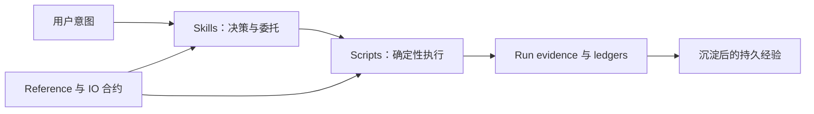

# xLLM AI Coding Workflow

语言：[English](README.md) | [简体中文](README_zh.md)

面向昇腾 NPU 大模型 serving 的证据驱动工作流、skills、脚本与参考知识库。**xLLM 是完整主路径。** vLLM-Ascend 与 SGLang 仅支持 [skill map](docs/architecture/skill-map.md) 中明确声明的 experimental adapter 或 artifact-analysis 范围。

## 选择任务入口

| 目标 | 首选入口 |
|---|---|
| 创建、恢复、finalize 或 archive 实验 | `xllm-experiment-lifecycle` |
| 多轮迭代优化 xLLM 性能 | `xllm-npu-sota-loop` |
| 执行性能与精度混合套件 | `xllm-npu-eval-runner` |
| 执行一次性能或精度 workload | `xllm-npu-perf-runner` 或 `xllm-npu-accuracy-runner` |
| 启动、验证、smoke 并清理服务 | `xllm-npu-server-manager` |
| 审查公平性或可发布性能结论 | `xllm-npu-benchmark` |
| 采集或分析 profiling 证据 | `xllm-npu-profiler` 或 `xllm-npu-pipeline-analysis` |
| 诊断错误输出或 runtime/build 事故 | `xllm-npu-accuracy-debug` 或 `xllm-npu-incident-triage` |
| 查询模型与 PR 历史经验 | `model-pr-optimization-history` |

在性能优化 campaign 中，`xllm-npu-sota-loop` 负责优化决策，`xllm-experiment-lifecycle` 负责可恢复 run 与 evidence 状态。

## 五分钟开始

初始化或复用 xLLM checkout，并安装 canonical skills：

```bash
python scripts/init_xllm_workspace.py
```

在当前仓库启动 Codex：

```bash
codex
```

然后选择[可复制 prompt](prompts/)，或从 [`experiment.example.yaml`](reference/io_specs/experiment.example.yaml) 创建实验。合成 lifecycle 演练见[入门指南](docs/getting-started.md)。

## 各部分如何协作


```mermaid
flowchart LR
  U["用户意图"] --> S["Skills：决策与委托"]
  S --> D["Scripts：确定性执行"]
  D --> E["Run evidence 与 ledgers"]
  R["Reference 与 IO 合约"] --> S
  R --> D
  E --> H["沉淀后的持久经验"]
```

Lifecycle 是控制面。编排器把有边界的工作委托给执行器、分析器、规划器和门禁；确定性脚本产出可审计 artifacts。

## 浏览能力

- [Skill 能力索引](skills/README.md) — 按角色和领域分组。
- [详细 skill 架构](docs/architecture/skill-map.md) — 依赖、scope、intent 与 outputs。
- [Agent 路由合约](AGENTS.md) — 精确 task-to-skill 与仓库约束。

## 文档

从[文档中心](docs/README.md)查找当前用户、架构、工作流和维护者指南。[标准 NPU AI coding workflow](docs/npu-ai-coding-standard-workflow.md)解释证据驱动的各阶段。历史 PR 设计记录会继续保留，但不是日常操作入口。

## 仓库地图

```text
skills/       过程化决策与委托
scripts/      确定性执行
reference/    稳定知识与 IO 合约
runs/         单任务证据；本地保存且不提交
humanize/     经验证后沉淀的持久经验
docs/         当前指南、架构与设计历史
tests/        catalog、导航、schema 与 workflow 校验
```

职责边界见[仓库与证据地图](docs/architecture/repository-map.md)。

## 贡献与支持边界

可复用决策流程进入 skills；确定性操作进入 scripts；schema 与稳定知识进入 reference；只有经验证的持久经验才进入 humanize。修改 catalog 能力前先阅读[新增或修改 skill](docs/maintainers/adding-or-changing-a-skill.md)。

不要提交本地路径、私有主机、凭据或非公开日志。仓库当前尚无 license；广泛外部复用前应先补充。
