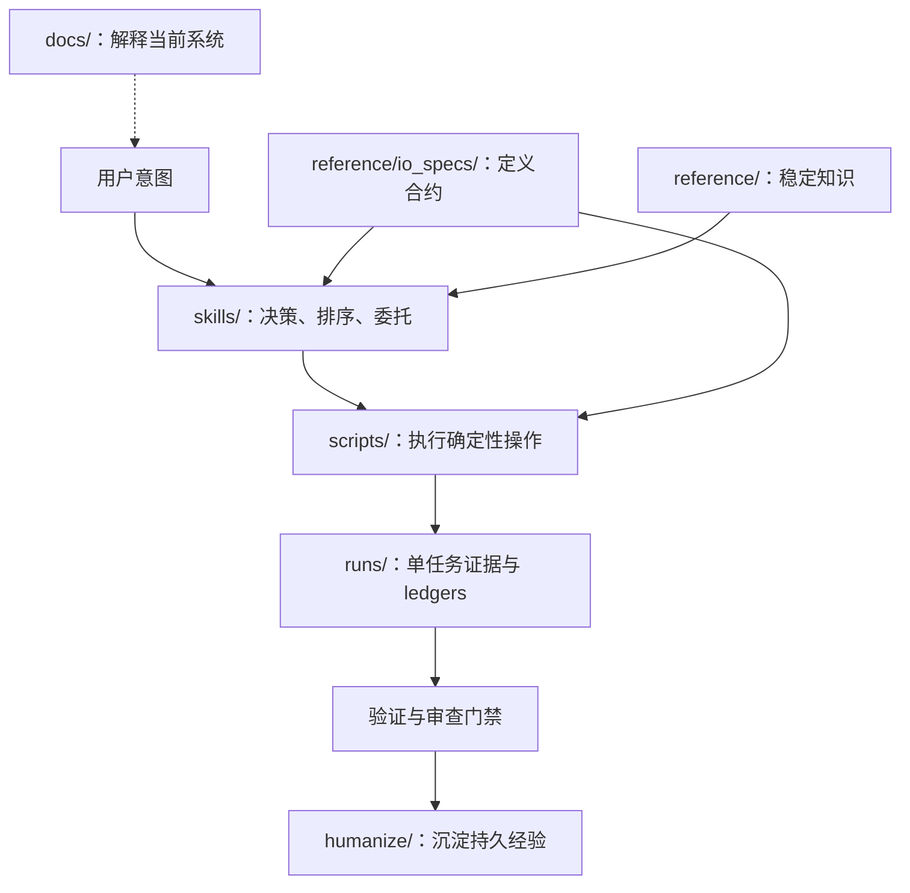

# 仓库与证据地图

仓库把过程化决策、确定性执行、合约、单任务证据与持久知识分开，使 agent 行为可审计，同时避免把文档或 catalog 误当成 runtime router。

## 证据流

## 职责边界

| 区域 | 负责 | 不负责 |
|---|---|---|
| `skills/` | 过程化决策、路由边界、委托与证据要求 | 确定性实现或单次 run 数据 |
| `scripts/` | 可复现 CLI 操作、验证、采集与投影 | 开放式判断或 skill 选择 |
| `reference/` | 稳定领域知识、代码规范、schema、模型与 PR 历史 | 可变任务状态 |
| `runs/` | 本地 run identity、原始 artifacts、ledgers、checkpoint 与 verdict | 提交到仓库的复用文档 |
| `humanize/` | 从完成证据中沉淀的经验 | 未验证笔记或完整原始 run |
| `docs/` | 当前用户、架构、工作流和维护指南 | Runtime routing metadata |
| `tests/` | Catalog、导航、schema、lifecycle 与仓库合约 | 生产 serving workload |

## Skill 架构

可安装 skills 保持 `skills/<canonical-id>/` 扁平布局。角色、领域、暴露方式、依赖、framework 与 backend 等逻辑视图来自 `skills/catalog.json`，并生成[能力索引](../../skills/README.md)和[详细 Skill 地图](skill-map.md)。

Lifecycle skill 负责 run 状态转换。编排器把任务委托给执行器、分析器、规划器、门禁与支持工具；内部 validator 保持为 script function，不新增 public skill。

## 当前文档与设计历史

[文档中心](../README.md)链接当前操作指南。`docs/pr12/` 记录建立现有 skill contract 的 taxonomy/routing 设计；`docs/pr14/` 记录本次信息架构调整。这些路径为审查溯源保持稳定，但不是必读入口。

## 支持边界

- **完整支持：** xLLM on Ascend 完整主工作流。
- **实验性 adapter：** 仅限 catalog 声明的构建或证据 adapter。
- **仅 artifact 分析：** 仅限显式声明的 vLLM-Ascend 或 SGLang 已有 artifacts。
- **内部 / 仅显式调用：** 委托实现不能成为隐式主路由。
