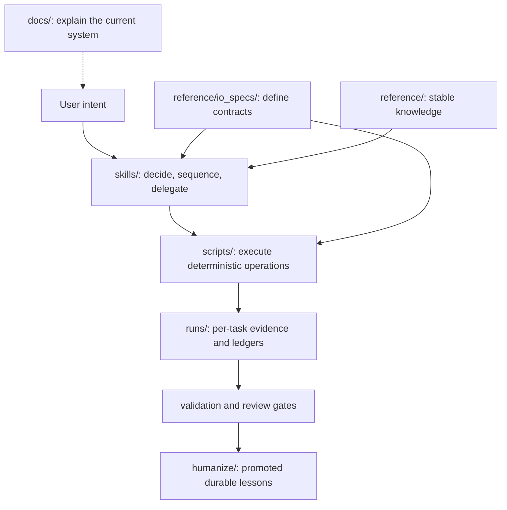

# Repository And Evidence Map

The repository separates procedural decisions, deterministic execution, contracts, task evidence, and durable knowledge. This keeps agent behavior auditable without turning documentation or the catalog into a runtime router.

## Evidence flow

## Responsibility boundaries

| Area | Owns | Does not own |
|---|---|---|
| `skills/` | Procedural decisions, routing boundaries, delegation, evidence requirements | Deterministic implementation or per-run data |
| `scripts/` | Reproducible CLI operations, validation, collection, projections | Open-ended judgment or skill selection |
| `reference/` | Stable domain knowledge, code style, schemas, model/PR history | Mutable task state |
| `runs/` | Local run identity, raw artifacts, ledgers, checkpoints, verdicts | Committed reusable documentation |
| `humanize/` | Promoted lessons supported by completed evidence | Unverified notes or complete raw runs |
| `docs/` | Current user, architecture, workflow, and maintainer guidance | Runtime routing metadata |
| `tests/` | Catalog, navigation, schema, lifecycle, and repository contracts | Production serving workloads |

## Skill architecture

Installable skills remain flat under `skills/<canonical-id>/`. Logical role, domain, exposure, dependency, framework, and backend views come from `skills/catalog.json` and are rendered into the [capability index](../../skills/README.md) and [detailed skill map](skill-map.md).

The lifecycle skill owns run state transitions. Orchestrators delegate to runners, analyzers, planners, gates, and support tools. Internal validators remain script functions rather than public skills.

## Current docs and design history

The [documentation hub](../README.md) links current operating guidance. `docs/pr12/` records the taxonomy and routing design that established the current skill contract; `docs/pr14/` records this information-architecture change. Those paths remain stable for review provenance but are not required starting points.

## Support boundary

- **Supported:** xLLM on Ascend is the complete primary workflow.
- **Experimental adapter:** only the catalog-declared build or evidence adapter surface.
- **Artifact analysis only:** existing vLLM-Ascend or SGLang artifacts where explicitly declared.
- **Internal / explicit-only:** delegated implementation that cannot become an implicit primary route.
