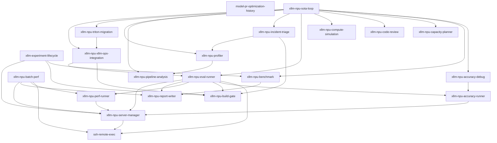

<!-- Generated by scripts/render_skill_docs.py. Do not edit manually. -->

# Skill 架构地图

此详细视图由 `skills/catalog.json` 生成。Presentation metadata 用于人类导航；routing 字段仍是 skill ownership 合约。

## 数量

- 公开：20
- 内部 / 仅显式调用：1
- Canonical skills 总数：21

## 角色与领域矩阵

| Canonical ID | 显示名称 | 角色 | 领域 | 暴露方式 |
|---|---|---|---|---|
| `model-pr-optimization-history` | [Model and PR History](../../skills/model-pr-optimization-history/SKILL.md) | `planning-and-knowledge` | `knowledge` | `public-primary` |
| `ssh-remote-exec` | [Remote SSH Execution](../../skills/ssh-remote-exec/SKILL.md) | `gates-and-support` | `remote-execution` | `internal-explicit-only` |
| `xllm-experiment-lifecycle` | [Experiment Lifecycle](../../skills/xllm-experiment-lifecycle/SKILL.md) | `orchestration` | `lifecycle` | `public-primary` |
| `xllm-npu-accuracy-debug` | [Accuracy Regression Debugging](../../skills/xllm-npu-accuracy-debug/SKILL.md) | `analysis-and-diagnosis` | `accuracy` | `public-primary` |
| `xllm-npu-accuracy-runner` | [Accuracy Evaluation Runner](../../skills/xllm-npu-accuracy-runner/SKILL.md) | `execution` | `accuracy` | `public-primary` |
| `xllm-npu-batch-perf` | [Batch Performance Campaign](../../skills/xllm-npu-batch-perf/SKILL.md) | `orchestration` | `performance` | `public-primary` |
| `xllm-npu-benchmark` | [Benchmark Fairness and Claims](../../skills/xllm-npu-benchmark/SKILL.md) | `analysis-and-diagnosis` | `performance` | `public-primary` |
| `xllm-npu-build-gate` | [Deterministic Build Gate](../../skills/xllm-npu-build-gate/SKILL.md) | `gates-and-support` | `build` | `public-primary` |
| `xllm-npu-capacity-planner` | [Serving Capacity Planner](../../skills/xllm-npu-capacity-planner/SKILL.md) | `planning-and-knowledge` | `capacity` | `public-primary` |
| `xllm-npu-code-review` | [NPU Code Review](../../skills/xllm-npu-code-review/SKILL.md) | `development-and-review` | `development` | `public-primary` |
| `xllm-npu-compute-simulation` | [NPU Compute Simulation](../../skills/xllm-npu-compute-simulation/SKILL.md) | `planning-and-knowledge` | `capacity` | `public-primary` |
| `xllm-npu-eval-runner` | [Mixed Evaluation Orchestrator](../../skills/xllm-npu-eval-runner/SKILL.md) | `orchestration` | `evaluation` | `public-primary` |
| `xllm-npu-incident-triage` | [NPU Incident Triage](../../skills/xllm-npu-incident-triage/SKILL.md) | `analysis-and-diagnosis` | `reliability` | `public-primary` |
| `xllm-npu-perf-runner` | [Performance Evaluation Runner](../../skills/xllm-npu-perf-runner/SKILL.md) | `execution` | `performance` | `public-primary` |
| `xllm-npu-pipeline-analysis` | [Serving Pipeline Analysis](../../skills/xllm-npu-pipeline-analysis/SKILL.md) | `analysis-and-diagnosis` | `profiling` | `public-primary` |
| `xllm-npu-profiler` | [Ascend NPU Profiler](../../skills/xllm-npu-profiler/SKILL.md) | `analysis-and-diagnosis` | `profiling` | `public-primary` |
| `xllm-npu-report-writer` | [Evaluation Report Writer](../../skills/xllm-npu-report-writer/SKILL.md) | `gates-and-support` | `reporting` | `public-primary` |
| `xllm-npu-server-manager` | [xLLM Service Manager](../../skills/xllm-npu-server-manager/SKILL.md) | `execution` | `evaluation` | `public-primary` |
| `xllm-npu-sota-loop` | [Performance Optimization Loop](../../skills/xllm-npu-sota-loop/SKILL.md) | `orchestration` | `performance` | `public-primary` |
| `xllm-npu-triton-migration` | [Triton-Ascend Operator Migration](../../skills/xllm-npu-triton-migration/SKILL.md) | `development-and-review` | `development` | `public-primary` |
| `xllm-npu-xllm-ops-integration` | [xllm_ops Runtime Integration](../../skills/xllm-npu-xllm-ops-integration/SKILL.md) | `development-and-review` | `development` | `public-primary` |

## 依赖关系图

依赖是 catalog 声明的 canonical skill 委托边。

## Framework 与 backend scope

| Canonical ID | Framework scope | Backend scope |
|---|---|---|
| `model-pr-optimization-history` | xllm; vllm-ascend-dossiers; sglang-dossiers | reference-artifacts |
| `ssh-remote-exec` | framework-neutral | remote-host; ascend-npu |
| `xllm-experiment-lifecycle` | xllm; adapter-artifact-lifecycle | backend-neutral-control-plane |
| `xllm-npu-accuracy-debug` | xllm | ascend-npu; reference-gpu |
| `xllm-npu-accuracy-runner` | xllm; openai-compatible-endpoint | ascend-npu |
| `xllm-npu-batch-perf` | xllm | ascend-npu |
| `xllm-npu-benchmark` | xllm; vllm-ascend-experimental; sglang-experimental | ascend-npu; nvidia-gpu-snapshot |
| `xllm-npu-build-gate` | xllm; vllm-ascend-build-adapter; sglang-build-adapter | ascend-npu; offline-build |
| `xllm-npu-capacity-planner` | xllm; vllm-ascend-experimental; sglang-experimental | ascend-npu |
| `xllm-npu-code-review` | xllm | ascend-npu |
| `xllm-npu-compute-simulation` | xllm; vllm-ascend-experimental; sglang-experimental | ascend-npu |
| `xllm-npu-eval-runner` | xllm; openai-compatible-endpoint | ascend-npu |
| `xllm-npu-incident-triage` | xllm | ascend-npu |
| `xllm-npu-perf-runner` | xllm; openai-compatible-endpoint | ascend-npu |
| `xllm-npu-pipeline-analysis` | xllm; vllm-ascend-artifacts; sglang-artifacts | ascend-npu |
| `xllm-npu-profiler` | xllm; vllm-ascend-artifacts | ascend-npu |
| `xllm-npu-report-writer` | artifact-format-neutral | backend-neutral |
| `xllm-npu-server-manager` | xllm | ascend-npu |
| `xllm-npu-sota-loop` | xllm | ascend-npu |
| `xllm-npu-triton-migration` | xllm; torch-npu-ops | triton-ascend; ascend-npu |
| `xllm-npu-xllm-ops-integration` | xllm | ascend-npu; xllm-ops |

## 公开 Skill 详情

### 模型与 PR 历史（Model and PR History，`model-pr-optimization-history`）

查询模型 dossier 中的历史改动、风险、失败经验和后续检查。

- **适用场景：** query model optimization and PR history; retrieve prior risks validation and next checks by model keyword or code path。
- **不适用场景：** open-ended performance optimization; new benchmark execution; live incident diagnosis。
- **输出：** matching dossier sections; historical risks; recommended next checks。
- **Skill：** [Model and PR History](../../skills/model-pr-optimization-history/SKILL.md)

### 实验生命周期（Experiment Lifecycle，`xllm-experiment-lifecycle`）

创建、恢复、验证、收口并归档可审计的实验 run。

- **适用场景：** experiment run creation and recovery; checkpoint attempt evidence finalize and archive lifecycle。
- **不适用场景：** performance optimization hypothesis selection; benchmark workload execution; service or profiler operation。
- **输出：** run root; checkpoint and attempt ledger; final evidence and retention record。
- **Skill：** [Experiment Lifecycle](../../skills/xllm-experiment-lifecycle/SKILL.md)

### 精度回归调试（Accuracy Regression Debugging，`xllm-npu-accuracy-debug`）

定位错误输出、评测掉分和 GPU/NPU 不一致。

- **适用场景：** accuracy regression diagnosis; wrong or garbled output diagnosis。
- **不适用场景：** accuracy measurement only; generic runtime incident。
- **输出：** minimal reproducer; root-cause evidence; validated next checks。
- **Skill：** [Accuracy Regression Debugging](../../skills/xllm-npu-accuracy-debug/SKILL.md)

### 精度评测执行器（Accuracy Evaluation Runner，`xllm-npu-accuracy-runner`）

对 ready 服务执行一次 EvalScope 精度 workload。

- **适用场景：** explicit EvalScope accuracy execution。
- **不适用场景：** accuracy root-cause diagnosis; mixed evaluation; benchmark fairness。
- **输出：** accuracy score; prediction records; evaluation artifacts。
- **Skill：** [Accuracy Evaluation Runner](../../skills/xllm-npu-accuracy-runner/SKILL.md)

### 批量性能 Campaign（Batch Performance Campaign，`xllm-npu-batch-perf`）

编排多模型、多配置或重复轮次的性能 campaign。

- **适用场景：** multi-model or multi-configuration performance campaign; repeated performance campaign。
- **不适用场景：** one ordinary performance run; fairness conclusion; accuracy evaluation。
- **输出：** campaign matrix results; per-run artifacts; aggregate summary。
- **Skill：** [Batch Performance Campaign](../../skills/xllm-npu-batch-perf/SKILL.md)

### Benchmark 公平性与结论（Benchmark Fairness and Claims，`xllm-npu-benchmark`）

审查公平对比、SLA 候选和可发布性能结论。

- **适用场景：** fair before-after or cross-framework comparison; SLA and QPS candidate review; publishable performance conclusion。
- **不适用场景：** raw EvalScope execution only; profiling root-cause analysis。
- **输出：** fairness verdict; before/after comparison; publishable claim scope。
- **Skill：** [Benchmark Fairness and Claims](../../skills/xllm-npu-benchmark/SKILL.md)

### 确定性构建门禁（Deterministic Build Gate，`xllm-npu-build-gate`）

验证 checkout 身份、确定性构建和 binary provenance。

- **适用场景：** explicit deterministic build and binary provenance validation。
- **不适用场景：** failed build root-cause diagnosis; performance optimization。
- **输出：** build verdict; binary provenance; dependency identity。
- **Skill：** [Deterministic Build Gate](../../skills/xllm-npu-build-gate/SKILL.md)

### Serving 容量规划（Serving Capacity Planner，`xllm-npu-capacity-planner`）

规划 HBM、KV cache 容量、并发和 OOM 风险。

- **适用场景：** HBM and KV-cache capacity planning; concurrency and OOM risk what-if。
- **不适用场景：** active OOM incident diagnosis; FLOPs modeling。
- **输出：** memory budget; concurrency estimate; OOM risk assessment。
- **Skill：** [Serving Capacity Planner](../../skills/xllm-npu-capacity-planner/SKILL.md)

### NPU 代码审查（NPU Code Review，`xllm-npu-code-review`）

审查 xLLM 昇腾补丁的正确性、性能风险和缺失验证。

- **适用场景：** xllm NPU-specific code review。
- **不适用场景：** generic non-NPU review; operator implementation。
- **输出：** severity-ranked findings; risk assessment; validation gaps。
- **Skill：** [NPU Code Review](../../skills/xllm-npu-code-review/SKILL.md)

### NPU 计算量模拟（NPU Compute Simulation，`xllm-npu-compute-simulation`）

估算 FLOPs、MFU、硬件上限和 serving shape 成本。

- **适用场景：** FLOPs and MFU estimation; hardware lower-bound and shape what-if。
- **不适用场景：** measured benchmark conclusion; HBM capacity planning。
- **输出：** compute estimate; MFU bound; shape what-if analysis。
- **Skill：** [NPU Compute Simulation](../../skills/xllm-npu-compute-simulation/SKILL.md)

### 混合评测编排器（Mixed Evaluation Orchestrator，`xllm-npu-eval-runner`）

编排服务、性能、精度和完整评测 artifacts。

- **适用场景：** mixed performance and accuracy evaluation; end-to-end evaluation artifact collection。
- **不适用场景：** service-only maintenance; benchmark fairness conclusion; profiling analysis; incident diagnosis。
- **输出：** service evidence; performance artifacts; accuracy artifacts。
- **Skill：** [Mixed Evaluation Orchestrator](../../skills/xllm-npu-eval-runner/SKILL.md)

### NPU 事故诊断（NPU Incident Triage，`xllm-npu-incident-triage`）

复现并诊断 runtime、通信、图模式和构建事故。

- **适用场景：** runtime crash hang HCCL graph or build incident diagnosis。
- **不适用场景：** stable accuracy regression; capacity planning; healthy build gate。
- **输出：** incident classification; root-cause evidence; fix validation plan。
- **Skill：** [NPU Incident Triage](../../skills/xllm-npu-incident-triage/SKILL.md)

### 性能评测执行器（Performance Evaluation Runner，`xllm-npu-perf-runner`）

对 ready 服务执行一次 EvalScope 性能 workload。

- **适用场景：** explicit EvalScope performance execution。
- **不适用场景：** performance optimization; fair comparison; profiling analysis。
- **输出：** raw performance results; normalized metrics; run artifacts。
- **Skill：** [Performance Evaluation Runner](../../skills/xllm-npu-perf-runner/SKILL.md)

### Serving Pipeline 分析（Serving Pipeline Analysis，`xllm-npu-pipeline-analysis`）

分析已有 profile 的阶段、layer、rank 偏斜和 decode step 气泡。

- **适用场景：** stage layer rank and decode-bubble analysis。
- **不适用场景：** trace collection; generic five-table profiling; raw performance execution。
- **输出：** pipeline phase map; rank-skew analysis; gap and bubble findings。
- **Skill：** [Serving Pipeline Analysis](../../skills/xllm-npu-pipeline-analysis/SKILL.md)

### 昇腾 NPU Profiler（Ascend NPU Profiler，`xllm-npu-profiler`）

采集昇腾 profile 并生成标准五表分析。

- **适用场景：** Ascend profile collection; generic five-table profile analysis。
- **不适用场景：** fair benchmark conclusion; raw performance run; pipeline-only analysis with complete artifacts。
- **输出：** profile capture; kernel and overlap tables; fusion and efficiency findings。
- **Skill：** [Ascend NPU Profiler](../../skills/xllm-npu-profiler/SKILL.md)

### 评测报告生成器（Evaluation Report Writer，`xllm-npu-report-writer`）

根据已完成 artifacts 和调用方模板生成结构化报告。

- **适用场景：** explicit report rendering from completed artifacts and supplied template。
- **不适用场景：** evaluation execution; fairness policy ownership; template ownership。
- **输出：** structured report; artifact summary; claim-limit section。
- **Skill：** [Evaluation Report Writer](../../skills/xllm-npu-report-writer/SKILL.md)

### xLLM 服务管理器（xLLM Service Manager，`xllm-npu-server-manager`）

启动、验证、smoke、停止并清理 xLLM 服务。

- **适用场景：** explicit xllm service launch ready smoke stop and cleanup。
- **不适用场景：** experiment lifecycle; evaluation workload execution; incident root-cause diagnosis。
- **输出：** launch identity; ready and smoke evidence; cleanup proof。
- **Skill：** [xLLM Service Manager](../../skills/xllm-npu-server-manager/SKILL.md)

### 性能优化闭环（Performance Optimization Loop，`xllm-npu-sota-loop`）

执行基于证据的多轮 xLLM 性能优化任务。

- **适用场景：** open-ended measurable performance optimization with code iteration。
- **不适用场景：** one benchmark review; one evaluation run; fixed profiling analysis; incident-only reproduction。
- **输出：** bottleneck budget; candidate ranking; reviewable patches; validated before/after evidence。
- **Skill：** [Performance Optimization Loop](../../skills/xllm-npu-sota-loop/SKILL.md)

### Triton-Ascend 算子迁移（Triton-Ascend Operator Migration，`xllm-npu-triton-migration`）

将 Triton-Ascend kernel 迁移为经过验证的 AOT 算子。

- **适用场景：** Triton-Ascend source operator migration to AOT。
- **不适用场景：** runtime integration of an existing operator; non-Triton migration。
- **输出：** Triton kernel; AOT artifact; accuracy and integration evidence。
- **Skill：** [Triton-Ascend Operator Migration](../../skills/xllm-npu-triton-migration/SKILL.md)

### xllm_ops Runtime 接入（xllm_ops Runtime Integration，`xllm-npu-xllm-ops-integration`）

把已有 xllm_ops 算子接入 xLLM runtime callsite。

- **适用场景：** integration of an existing xllm_ops operator into xllm runtime。
- **不适用场景：** source operator migration; generic runtime feature。
- **输出：** runtime wrapper; operation registration; build and end-to-end evidence。
- **Skill：** [xllm_ops Runtime Integration](../../skills/xllm-npu-xllm-ops-integration/SKILL.md)

## 内部 / 仅显式调用

### 远程 SSH 执行（Remote SSH Execution，`ssh-remote-exec`）

为委托流程执行显式请求的 SSH 与远程容器命令。

该能力不能参与隐式主路由。

- **输出：** remote command output; background-task status。
- **Skill：** [Remote SSH Execution](../../skills/ssh-remote-exec/SKILL.md)

## 支持边界

**完整支持：** xLLM on Ascend 是完整主工作流。
**实验性 adapter / 仅 artifact 分析：** vLLM-Ascend 与 SGLang 仅限上表列出的 catalog scope。
**内部 / 仅显式调用：** internal skills 不参与隐式主路由。
