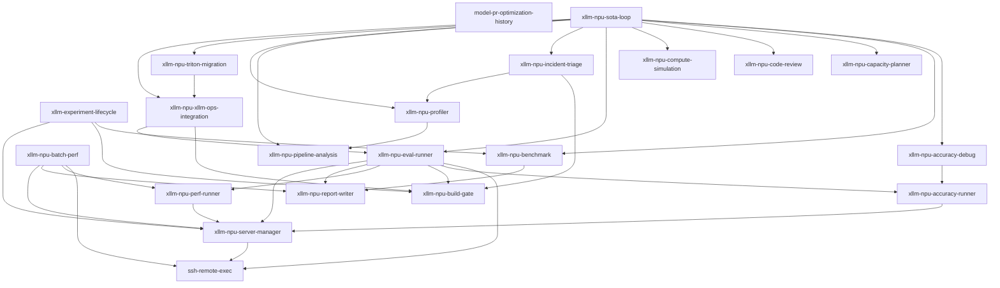

<!-- Generated by scripts/render_skill_docs.py. Do not edit manually. -->

# Skill Architecture Map

This detailed view is generated from `skills/catalog.json`. Presentation metadata explains human navigation; routing fields remain the skill ownership contract.

## Counts

- Public: 20
- Internal / explicit-only: 1
- Total canonical skills: 21

## Role and domain matrix

| Canonical ID | Display name | Role | Domain | Exposure |
|---|---|---|---|---|
| `model-pr-optimization-history` | [Model and PR History](../../skills/model-pr-optimization-history/SKILL.md) | `planning-and-knowledge` | `knowledge` | `public-primary` |
| `ssh-remote-exec` | [Remote SSH Execution](../../skills/ssh-remote-exec/SKILL.md) | `gates-and-support` | `remote-execution` | `internal-explicit-only` |
| `xllm-experiment-lifecycle` | [Experiment Lifecycle](../../skills/xllm-experiment-lifecycle/SKILL.md) | `orchestration` | `lifecycle` | `public-primary` |
| `xllm-npu-accuracy-debug` | [Accuracy Regression Debugging](../../skills/xllm-npu-accuracy-debug/SKILL.md) | `analysis-and-diagnosis` | `accuracy` | `public-primary` |
| `xllm-npu-accuracy-runner` | [Accuracy Evaluation Runner](../../skills/xllm-npu-accuracy-runner/SKILL.md) | `execution` | `accuracy` | `public-primary` |
| `xllm-npu-batch-perf` | [Batch Performance Campaign](../../skills/xllm-npu-batch-perf/SKILL.md) | `orchestration` | `performance` | `public-primary` |
| `xllm-npu-benchmark` | [Benchmark Fairness and Claims](../../skills/xllm-npu-benchmark/SKILL.md) | `analysis-and-diagnosis` | `performance` | `public-primary` |
| `xllm-npu-build-gate` | [Deterministic Build Gate](../../skills/xllm-npu-build-gate/SKILL.md) | `gates-and-support` | `build` | `public-primary` |
| `xllm-npu-capacity-planner` | [Serving Capacity Planner](../../skills/xllm-npu-capacity-planner/SKILL.md) | `planning-and-knowledge` | `capacity` | `public-primary` |
| `xllm-npu-code-review` | [NPU Code Review](../../skills/xllm-npu-code-review/SKILL.md) | `development-and-review` | `development` | `public-primary` |
| `xllm-npu-compute-simulation` | [NPU Compute Simulation](../../skills/xllm-npu-compute-simulation/SKILL.md) | `planning-and-knowledge` | `capacity` | `public-primary` |
| `xllm-npu-eval-runner` | [Mixed Evaluation Orchestrator](../../skills/xllm-npu-eval-runner/SKILL.md) | `orchestration` | `evaluation` | `public-primary` |
| `xllm-npu-incident-triage` | [NPU Incident Triage](../../skills/xllm-npu-incident-triage/SKILL.md) | `analysis-and-diagnosis` | `reliability` | `public-primary` |
| `xllm-npu-perf-runner` | [Performance Evaluation Runner](../../skills/xllm-npu-perf-runner/SKILL.md) | `execution` | `performance` | `public-primary` |
| `xllm-npu-pipeline-analysis` | [Serving Pipeline Analysis](../../skills/xllm-npu-pipeline-analysis/SKILL.md) | `analysis-and-diagnosis` | `profiling` | `public-primary` |
| `xllm-npu-profiler` | [Ascend NPU Profiler](../../skills/xllm-npu-profiler/SKILL.md) | `analysis-and-diagnosis` | `profiling` | `public-primary` |
| `xllm-npu-report-writer` | [Evaluation Report Writer](../../skills/xllm-npu-report-writer/SKILL.md) | `gates-and-support` | `reporting` | `public-primary` |
| `xllm-npu-server-manager` | [xLLM Service Manager](../../skills/xllm-npu-server-manager/SKILL.md) | `execution` | `evaluation` | `public-primary` |
| `xllm-npu-sota-loop` | [Performance Optimization Loop](../../skills/xllm-npu-sota-loop/SKILL.md) | `orchestration` | `performance` | `public-primary` |
| `xllm-npu-triton-migration` | [Triton-Ascend Operator Migration](../../skills/xllm-npu-triton-migration/SKILL.md) | `development-and-review` | `development` | `public-primary` |
| `xllm-npu-xllm-ops-integration` | [xllm_ops Runtime Integration](../../skills/xllm-npu-xllm-ops-integration/SKILL.md) | `development-and-review` | `development` | `public-primary` |

## Dependency graph

Dependencies are catalog-declared delegation edges between canonical skills.

## Framework and backend scope

| Canonical ID | Framework scope | Backend scope |
|---|---|---|
| `model-pr-optimization-history` | xllm; vllm-ascend-dossiers; sglang-dossiers | reference-artifacts |
| `ssh-remote-exec` | framework-neutral | remote-host; ascend-npu |
| `xllm-experiment-lifecycle` | xllm; adapter-artifact-lifecycle | backend-neutral-control-plane |
| `xllm-npu-accuracy-debug` | xllm | ascend-npu; reference-gpu |
| `xllm-npu-accuracy-runner` | xllm; openai-compatible-endpoint | ascend-npu |
| `xllm-npu-batch-perf` | xllm | ascend-npu |
| `xllm-npu-benchmark` | xllm; vllm-ascend-experimental; sglang-experimental | ascend-npu; nvidia-gpu-snapshot |
| `xllm-npu-build-gate` | xllm; vllm-ascend-build-adapter; sglang-build-adapter | ascend-npu; offline-build |
| `xllm-npu-capacity-planner` | xllm; vllm-ascend-experimental; sglang-experimental | ascend-npu |
| `xllm-npu-code-review` | xllm | ascend-npu |
| `xllm-npu-compute-simulation` | xllm; vllm-ascend-experimental; sglang-experimental | ascend-npu |
| `xllm-npu-eval-runner` | xllm; openai-compatible-endpoint | ascend-npu |
| `xllm-npu-incident-triage` | xllm | ascend-npu |
| `xllm-npu-perf-runner` | xllm; openai-compatible-endpoint | ascend-npu |
| `xllm-npu-pipeline-analysis` | xllm; vllm-ascend-artifacts; sglang-artifacts | ascend-npu |
| `xllm-npu-profiler` | xllm; vllm-ascend-artifacts | ascend-npu |
| `xllm-npu-report-writer` | artifact-format-neutral | backend-neutral |
| `xllm-npu-server-manager` | xllm | ascend-npu |
| `xllm-npu-sota-loop` | xllm | ascend-npu |
| `xllm-npu-triton-migration` | xllm; torch-npu-ops | triton-ascend; ascend-npu |
| `xllm-npu-xllm-ops-integration` | xllm | ascend-npu; xllm-ops |

## Public skill details

### Model and PR History (`model-pr-optimization-history`)

Query model dossiers for prior changes, risks, failures, and next checks.

- **Use when:** query model optimization and PR history; retrieve prior risks validation and next checks by model keyword or code path.
- **Do not use when:** open-ended performance optimization; new benchmark execution; live incident diagnosis.
- **Outputs:** matching dossier sections; historical risks; recommended next checks.
- **Skill:** [Model and PR History](../../skills/model-pr-optimization-history/SKILL.md)

### Experiment Lifecycle (`xllm-experiment-lifecycle`)

Create, resume, validate, finalize, and archive auditable experiment runs.

- **Use when:** experiment run creation and recovery; checkpoint attempt evidence finalize and archive lifecycle.
- **Do not use when:** performance optimization hypothesis selection; benchmark workload execution; service or profiler operation.
- **Outputs:** run root; checkpoint and attempt ledger; final evidence and retention record.
- **Skill:** [Experiment Lifecycle](../../skills/xllm-experiment-lifecycle/SKILL.md)

### Accuracy Regression Debugging (`xllm-npu-accuracy-debug`)

Diagnose incorrect output, score regressions, and GPU/NPU mismatches.

- **Use when:** accuracy regression diagnosis; wrong or garbled output diagnosis.
- **Do not use when:** accuracy measurement only; generic runtime incident.
- **Outputs:** minimal reproducer; root-cause evidence; validated next checks.
- **Skill:** [Accuracy Regression Debugging](../../skills/xllm-npu-accuracy-debug/SKILL.md)

### Accuracy Evaluation Runner (`xllm-npu-accuracy-runner`)

Run one EvalScope accuracy workload against a ready service.

- **Use when:** explicit EvalScope accuracy execution.
- **Do not use when:** accuracy root-cause diagnosis; mixed evaluation; benchmark fairness.
- **Outputs:** accuracy score; prediction records; evaluation artifacts.
- **Skill:** [Accuracy Evaluation Runner](../../skills/xllm-npu-accuracy-runner/SKILL.md)

### Batch Performance Campaign (`xllm-npu-batch-perf`)

Orchestrate multi-model, multi-configuration, or repeated performance campaigns.

- **Use when:** multi-model or multi-configuration performance campaign; repeated performance campaign.
- **Do not use when:** one ordinary performance run; fairness conclusion; accuracy evaluation.
- **Outputs:** campaign matrix results; per-run artifacts; aggregate summary.
- **Skill:** [Batch Performance Campaign](../../skills/xllm-npu-batch-perf/SKILL.md)

### Benchmark Fairness and Claims (`xllm-npu-benchmark`)

Review fair comparisons, SLA candidates, and publishable performance claims.

- **Use when:** fair before-after or cross-framework comparison; SLA and QPS candidate review; publishable performance conclusion.
- **Do not use when:** raw EvalScope execution only; profiling root-cause analysis.
- **Outputs:** fairness verdict; before/after comparison; publishable claim scope.
- **Skill:** [Benchmark Fairness and Claims](../../skills/xllm-npu-benchmark/SKILL.md)

### Deterministic Build Gate (`xllm-npu-build-gate`)

Validate checkout identity, deterministic builds, and binary provenance.

- **Use when:** explicit deterministic build and binary provenance validation.
- **Do not use when:** failed build root-cause diagnosis; performance optimization.
- **Outputs:** build verdict; binary provenance; dependency identity.
- **Skill:** [Deterministic Build Gate](../../skills/xllm-npu-build-gate/SKILL.md)

### Serving Capacity Planner (`xllm-npu-capacity-planner`)

Plan HBM, KV-cache capacity, concurrency, and OOM risk.

- **Use when:** HBM and KV-cache capacity planning; concurrency and OOM risk what-if.
- **Do not use when:** active OOM incident diagnosis; FLOPs modeling.
- **Outputs:** memory budget; concurrency estimate; OOM risk assessment.
- **Skill:** [Serving Capacity Planner](../../skills/xllm-npu-capacity-planner/SKILL.md)

### NPU Code Review (`xllm-npu-code-review`)

Review xLLM Ascend patches for correctness, performance risk, and missing validation.

- **Use when:** xllm NPU-specific code review.
- **Do not use when:** generic non-NPU review; operator implementation.
- **Outputs:** severity-ranked findings; risk assessment; validation gaps.
- **Skill:** [NPU Code Review](../../skills/xllm-npu-code-review/SKILL.md)

### NPU Compute Simulation (`xllm-npu-compute-simulation`)

Estimate FLOPs, MFU, hardware bounds, and serving-shape costs.

- **Use when:** FLOPs and MFU estimation; hardware lower-bound and shape what-if.
- **Do not use when:** measured benchmark conclusion; HBM capacity planning.
- **Outputs:** compute estimate; MFU bound; shape what-if analysis.
- **Skill:** [NPU Compute Simulation](../../skills/xllm-npu-compute-simulation/SKILL.md)

### Mixed Evaluation Orchestrator (`xllm-npu-eval-runner`)

Coordinate service, performance, accuracy, and complete evaluation artifacts.

- **Use when:** mixed performance and accuracy evaluation; end-to-end evaluation artifact collection.
- **Do not use when:** service-only maintenance; benchmark fairness conclusion; profiling analysis; incident diagnosis.
- **Outputs:** service evidence; performance artifacts; accuracy artifacts.
- **Skill:** [Mixed Evaluation Orchestrator](../../skills/xllm-npu-eval-runner/SKILL.md)

### NPU Incident Triage (`xllm-npu-incident-triage`)

Replay and diagnose runtime, communication, graph, and build incidents.

- **Use when:** runtime crash hang HCCL graph or build incident diagnosis.
- **Do not use when:** stable accuracy regression; capacity planning; healthy build gate.
- **Outputs:** incident classification; root-cause evidence; fix validation plan.
- **Skill:** [NPU Incident Triage](../../skills/xllm-npu-incident-triage/SKILL.md)

### Performance Evaluation Runner (`xllm-npu-perf-runner`)

Run one EvalScope performance workload against a ready service.

- **Use when:** explicit EvalScope performance execution.
- **Do not use when:** performance optimization; fair comparison; profiling analysis.
- **Outputs:** raw performance results; normalized metrics; run artifacts.
- **Skill:** [Performance Evaluation Runner](../../skills/xllm-npu-perf-runner/SKILL.md)

### Serving Pipeline Analysis (`xllm-npu-pipeline-analysis`)

Analyze stages, layers, rank skew, and decode-step bubbles in existing profiles.

- **Use when:** stage layer rank and decode-bubble analysis.
- **Do not use when:** trace collection; generic five-table profiling; raw performance execution.
- **Outputs:** pipeline phase map; rank-skew analysis; gap and bubble findings.
- **Skill:** [Serving Pipeline Analysis](../../skills/xllm-npu-pipeline-analysis/SKILL.md)

### Ascend NPU Profiler (`xllm-npu-profiler`)

Collect Ascend profiles and produce the standard five-table analysis.

- **Use when:** Ascend profile collection; generic five-table profile analysis.
- **Do not use when:** fair benchmark conclusion; raw performance run; pipeline-only analysis with complete artifacts.
- **Outputs:** profile capture; kernel and overlap tables; fusion and efficiency findings.
- **Skill:** [Ascend NPU Profiler](../../skills/xllm-npu-profiler/SKILL.md)

### Evaluation Report Writer (`xllm-npu-report-writer`)

Render structured reports from completed artifacts and a supplied template.

- **Use when:** explicit report rendering from completed artifacts and supplied template.
- **Do not use when:** evaluation execution; fairness policy ownership; template ownership.
- **Outputs:** structured report; artifact summary; claim-limit section.
- **Skill:** [Evaluation Report Writer](../../skills/xllm-npu-report-writer/SKILL.md)

### xLLM Service Manager (`xllm-npu-server-manager`)

Launch, verify, smoke-test, stop, and clean up xLLM services.

- **Use when:** explicit xllm service launch ready smoke stop and cleanup.
- **Do not use when:** experiment lifecycle; evaluation workload execution; incident root-cause diagnosis.
- **Outputs:** launch identity; ready and smoke evidence; cleanup proof.
- **Skill:** [xLLM Service Manager](../../skills/xllm-npu-server-manager/SKILL.md)

### Performance Optimization Loop (`xllm-npu-sota-loop`)

Run an evidence-driven, multi-round xLLM performance optimization campaign.

- **Use when:** open-ended measurable performance optimization with code iteration.
- **Do not use when:** one benchmark review; one evaluation run; fixed profiling analysis; incident-only reproduction.
- **Outputs:** bottleneck budget; candidate ranking; reviewable patches; validated before/after evidence.
- **Skill:** [Performance Optimization Loop](../../skills/xllm-npu-sota-loop/SKILL.md)

### Triton-Ascend Operator Migration (`xllm-npu-triton-migration`)

Migrate Triton-Ascend kernels into validated AOT operator form.

- **Use when:** Triton-Ascend source operator migration to AOT.
- **Do not use when:** runtime integration of an existing operator; non-Triton migration.
- **Outputs:** Triton kernel; AOT artifact; accuracy and integration evidence.
- **Skill:** [Triton-Ascend Operator Migration](../../skills/xllm-npu-triton-migration/SKILL.md)

### xllm_ops Runtime Integration (`xllm-npu-xllm-ops-integration`)

Integrate an existing xllm_ops operator into xLLM runtime call sites.

- **Use when:** integration of an existing xllm_ops operator into xllm runtime.
- **Do not use when:** source operator migration; generic runtime feature.
- **Outputs:** runtime wrapper; operation registration; build and end-to-end evidence.
- **Skill:** [xllm_ops Runtime Integration](../../skills/xllm-npu-xllm-ops-integration/SKILL.md)

## Internal / explicit-only

### Remote SSH Execution (`ssh-remote-exec`)

Execute explicitly requested SSH and remote-container commands for delegated workflows.

This capability is not eligible for implicit primary routing.

- **Outputs:** remote command output; background-task status.
- **Skill:** [Remote SSH Execution](../../skills/ssh-remote-exec/SKILL.md)

## Support boundary

**Supported:** xLLM on Ascend is the complete primary workflow.  
**Experimental adapter / artifact analysis only:** vLLM-Ascend and SGLang are limited to the exact catalog scopes shown above.  
**Internal / explicit-only:** internal skills do not participate in implicit primary routing.
