# PR12 Current Skill DAG

Baseline: `main@8e0a37e`.

## Runtime And Delegation DAG

This graph removes documentation backlinks and shows intended call/delegation direction.

```mermaid
flowchart TD
    User["User intent"]
    Flow["xllm-flow deterministic control plane"]
    Sota["xllm-npu-sota-loop"]
    Eval["xllm-npu-eval-runner"]
    Batch["xllm-npu-batch-perf"]
    Bench["xllm-npu-benchmark"]
    Build["xllm-npu-build-gate"]
    Server["xllm-npu-server-manager"]
    Perf["xllm-npu-perf-runner"]
    Accuracy["xllm-npu-accuracy-runner"]
    Report["xllm-npu-report-writer"]
    Profiler["xllm-npu-profiler"]
    Pipeline["xllm-npu-pipeline-analysis"]
    Capacity["xllm-npu-capacity-planner"]
    Compute["xllm-npu-compute-simulation"]
    AccuracyDebug["xllm-npu-accuracy-debug"]
    Incident["xllm-npu-incident-triage"]
    Review["xllm-npu-code-review"]
    Triton["xllm-npu-triton-migration"]
    Ops["xllm-npu-xllm-ops-integration"]
    SSH["ssh-remote-exec"]
    Evidence["validate_run_evidence.py"]
    Fairness["benchmark_fairness_gate.py"]

    User --> Sota
    User --> Eval
    User --> Batch
    User --> Bench
    User --> Build
    User --> Server
    User --> Profiler
    User --> Pipeline
    User --> Capacity
    User --> Compute
    User --> AccuracyDebug
    User --> Incident
    User --> Review
    User --> Triton
    User --> Ops

    Sota --> Flow
    Sota --> Eval
    Sota --> Bench
    Sota --> Profiler
    Sota --> Pipeline
    Sota --> Capacity
    Sota --> Compute
    Sota --> AccuracyDebug
    Sota --> Incident
    Sota --> Review
    Sota --> Triton
    Sota --> Ops

    Eval --> Build
    Eval --> Server
    Eval --> Perf
    Eval --> Accuracy
    Eval --> Report
    Eval --> Evidence
    Batch --> Server
    Batch --> Perf
    Batch --> Report
    Batch --> SSH
    Bench --> Evidence
    Bench --> Fairness
    Bench --> Report
    Profiler --> Pipeline
    Profiler --> Evidence
    Accuracy --> AccuracyDebug
    Build --> Incident
    Server --> SSH
    Triton --> Ops
    Flow --> Evidence
    Flow --> Fairness
```

## Evidence For Important Edges

| Edge | Evidence |
|---|---|
| SOTA to xllm-flow | `skills/xllm-npu-sota-loop/SKILL.md:32-38,69-72,142,271-273` |
| SOTA to specialists | `skills/xllm-npu-sota-loop/SKILL.md:75-125,187-219` |
| Eval to build/server/perf/accuracy | `skills/xllm-npu-eval-runner/SKILL.md:19-26,84-95,139-150,178-252` |
| Batch to server/perf/report | `skills/xllm-npu-batch-perf/SKILL.md:52-59,227-349`; actual perf script edge in `run_single_model.sh:10` |
| Benchmark to evidence/fairness | `skills/xllm-npu-benchmark/SKILL.md:129-145` |
| xllm-flow to evidence/fairness | `scripts/xllm_flow.py:1090-1139` |
| Server lifecycle implementation | `run.sh:202`, `stop.sh:114`, `service_lifecycle.py` tests |
| Profiler to pipeline | `skills/xllm-npu-profiler/SKILL.md:27-34` |

## Apparent Cycles That Are Documentation Backlinks

- Profiler and pipeline-analysis mention each other. Runtime direction is profiler artifact to pipeline analysis; pipeline may request missing profiler artifacts but does not call profiler code.
- Eval and benchmark mention each other. Runtime direction depends on intent: eval produces candidate artifacts, benchmark consumes them; benchmark may request additional eval runs but should not execute them itself.
- Report writer lists callers while callers list report writer. Runtime direction is caller to report writer.
- Server manager lists its callers while they list server manager. Runtime direction is orchestrator/runner to server manager.

## Structural Finding

`xllm-flow` is the mandatory lifecycle root but is absent from the public skill graph. The current user-entry graph therefore begins below the control plane and relies on each orchestrator to remember lifecycle obligations.

The executable graph itself is acyclic. `xllm-flow` reads build and service verdict artifacts;
it does not invoke build or service scripts. It directly invokes only the evidence validator and
fairness gate, while Big-Rock validation is in-process. The install graph has a separate orphan:
`reference/pr_history/SKILL.md` is not enumerated by the current installer.
